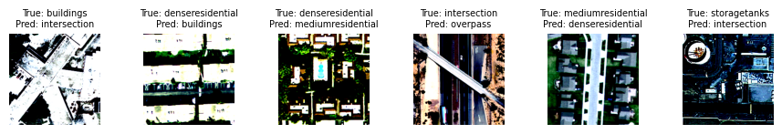
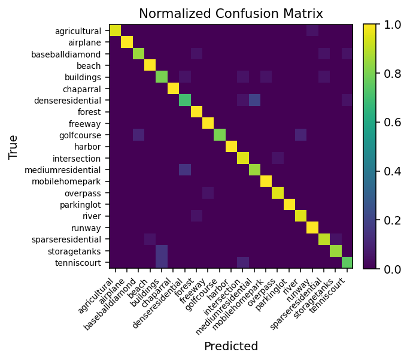

# 01. Classification — Scene Classification  

This project presents a structured machine learning workflow for scene-level classification on Earth Observation (EO) imagery, with emphasis on reproducibility, fair evaluation, and model comparison under small-data conditions.

---

## Task

Classify land-use scenes from EO imagery into semantic categories (e.g. forest, residential, agricultural).

---

## Approach

Two modeling strategies are implemented:

- **Feature-based ML (baseline)**  
  SVM trained on fixed feature embeddings extracted from a pretrained ResNet

- **Deep Learning (CNN-based transfer learning)**  
  AlexNet, VGG16, and ResNet architectures fine-tuned via transfer learning on RGB imagery

---

## Dataset

- UC Merced Land Use Dataset  
- Image size: 256 × 256 × 3  
- Multi-class classification

### Dataset Details

- Total images: 2,100
- Number of classes: 21
- Class distribution: balanced (100 images per class)
- Train / validation / test split: 60% / 20% / 20% (stratified)

**Class names**: agricultural · airplane · baseball diamond · beach · buildings · chaparral · dense residential · forest · freeway · golf course · harbor · intersection · medium residential · mobile home park · overpass · parking lot · river · runway · sparse residential · storage tanks · tennis court

---

## Results

| Model                 | Accuracy (%) | Notes                                                              |
| --------------------- | ------------ | ------------------------------------------------------------------ |
| SVM (ResNet features) | 91.9         | Fixed pretrained embeddings (no fine-tuning)                       |
| AlexNet               | 86.4         | Shallow CNN baseline (limited capacity)                            |
| VGG16                 | 82.9         | High-capacity CNN — prone to overfitting on small data             |
| ResNet18              | 97.1         | Residual learning — efficient and stable                           |
| ResNet50              | **98.6**     | Best-performing model                                              |
| ResNet101             | 96.7         | Increased depth without performance improvement                    |

ResNet50 achieves the best trade-off between accuracy and model complexity, while deeper variants show diminishing returns.

**Evaluation metrics:**
- Overall Accuracy (OA)  
- Average Accuracy (AA)  
- Confusion Matrix (class-wise performance) 

**Key observations:**
- CNNs outperform feature-based ML by learning task-specific representations  
- Feature-based SVM remains a strong baseline using fixed deep embeddings  
- Residual networks outperform AlexNet/VGG due to stable deep feature learning 
- Transfer learning is effective in small-data EO scenarios  
  
---

## Visual Results

### Sample Predictions (ResNet50)

**Correct predictions**
<p align="center">
  
</p>

**Misclassified samples (6 errors out of 420 test images)**
<p align="center">
  
</p>

Errors are concentrated between visually similar classes (e.g. residential vs road-related structures), highlighting ambiguity in spatial patterns.

### Normalized confusion matrices (SVM baseline vs ResNet50)

<p align="center">
  
  
</p>

---

## Training Setup

- Optimizer: SGD (momentum = 0.9, weight decay = 1e-4)   
- Learning rate: 1e-2  
- Batch size: 65
- Epochs: 10  
- Loss function: CrossEntropyLoss  
- Pretraining: ImageNet weights  

---

## Key Takeaways

- Spatial context is critical for EO scene classification
- Urban classes with similar spatial patterns remain challenging under RGB-only representation
- Feature-based baselines provide a meaningful reference under small-data conditions  
- Simple architectures and clean training pipelines outperform unnecessary model complexity and over-engineered solutions

---

## Project Structure

```
01-classification/
├── images/                               # figures (predictions, confusion matrices)
├── scene_classification_ucmerced.ipynb
├── scene_classification_ucmerced.html
└── README.md
```

---


## Tech Stack

- Python  
- PyTorch  
- Scikit-learn  
- NumPy / Matplotlib  

---

## Reproducibility

All steps (data loading, preprocessing, training, evaluation) are contained in:

- `scene_classification_ucmerced.{ipynb,html}` — full workflow and static view

The pipeline uses a fixed random seed and stratified splits to ensure consistent results.
