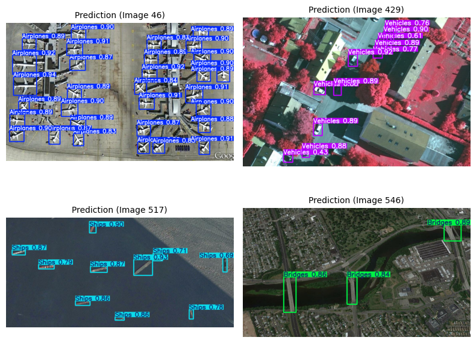
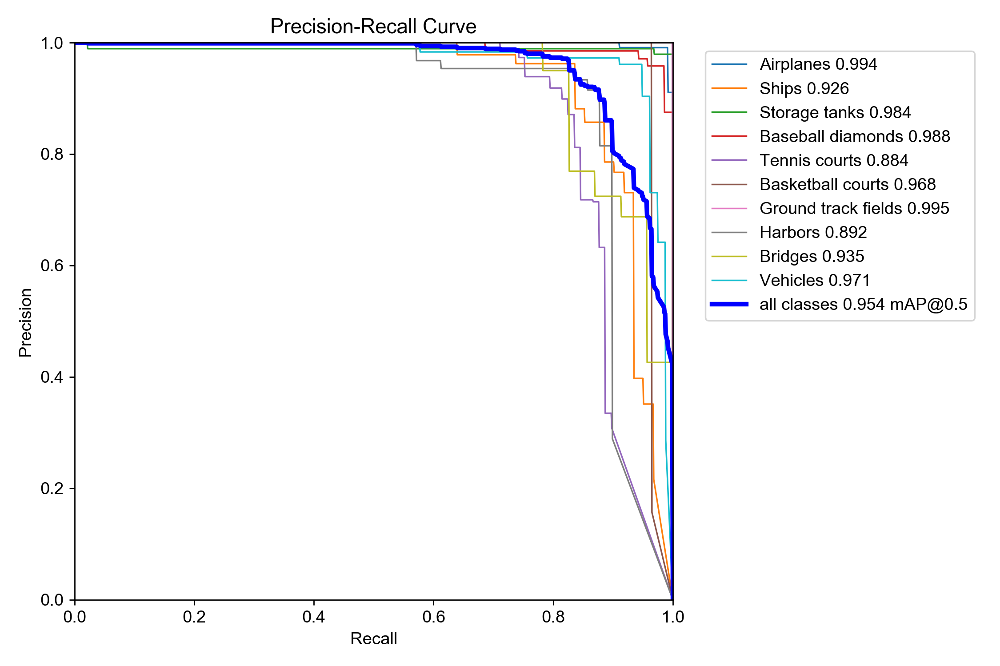
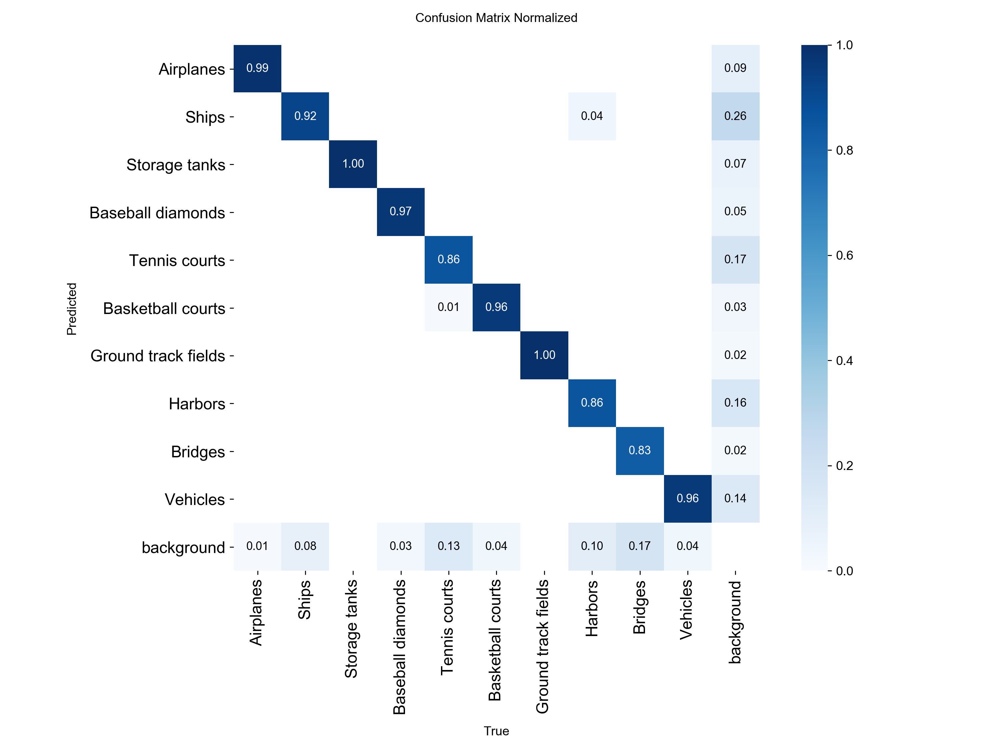
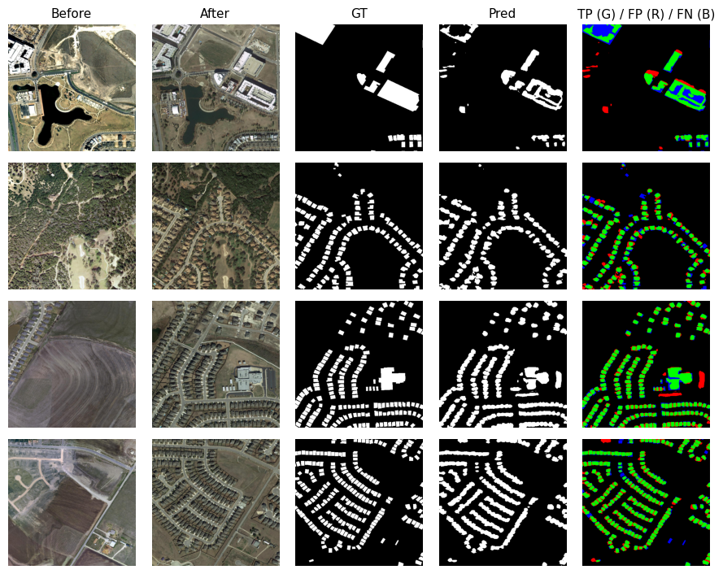
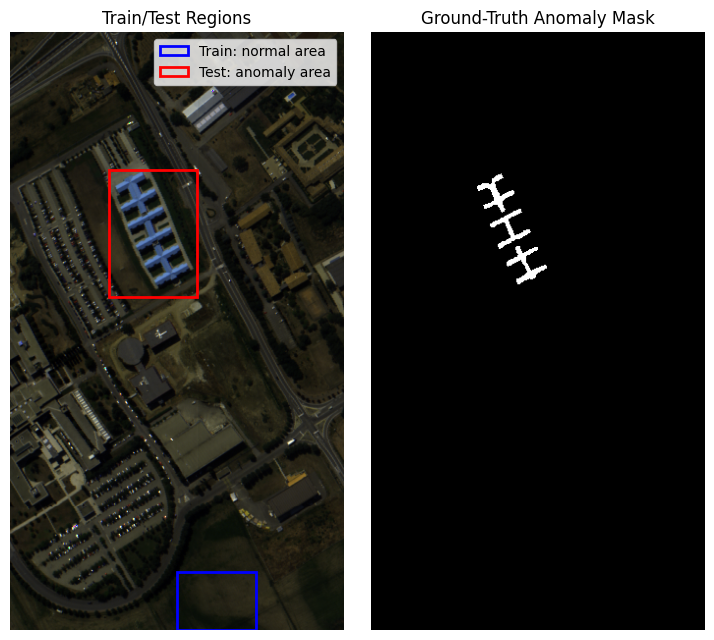
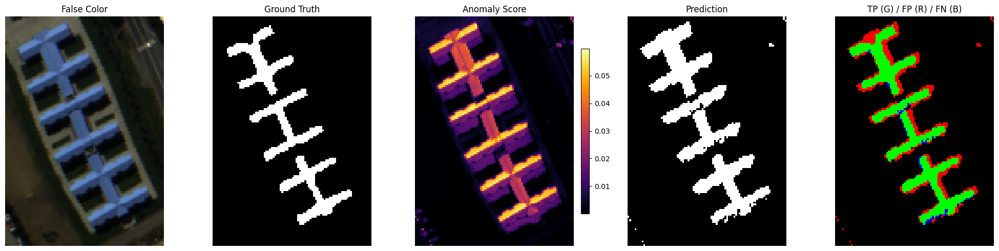

# 03. Detection — Object, Change, and Anomaly Detection

This folder contains three compact detection case studies on Earth Observation (EO) imagery, covering object detection, change detection, and hyperspectral anomaly detection.

The focus is on identifying regions of interest under limited-data conditions, using task-appropriate model designs and evaluation metrics.

---

## Case Studies

### 1. Object Detection
Multi-class object detection on very high-resolution EO imagery using YOLOv8.

**Notebook:** `01_object_detection_vhr10.{ipynb,html}`

### 2. Change Detection
Pixel-wise building change detection from bi-temporal EO image pairs.

**Notebook:** `02_change_detection_levircd.{ipynb,html}`

### 3. Hyperspectral Anomaly Detection
Unsupervised anomaly detection using reconstruction-based spectral models.

**Notebook:** `03_anomaly_detection_paviaU_hyperspectral.{ipynb,html}`

---

## Approach

- Object detection with YOLOv8, comparing model size, input resolution, and training duration
- Change detection with CNN, encoder–decoder, Siamese, and transformer-based architectures
- Hyperspectral anomaly detection with autoencoders, comparing global vs local spectral modeling
- Evaluation with task-specific metrics such as mAP, F1, IoU, PR AUC, and ROC AUC
- Each task is studied under controlled settings to isolate the effect of model design, input representation, and data characteristics.

---

## Datasets

### Object Detection — NWPU VHR-10

- Very high-resolution RGB aerial imagery
- Bounding box annotations
- 10 object classes:
  - airplanes · ships · storage tanks · baseball diamonds · tennis courts · basketball courts · ground track fields · harbors · bridges · vehicles
- Resized to 416x416 / 512x512 / 640x640 for training
- Total samples: 650 images
- Train / validation / test split: 60 / 20 / 20 (fixed seed)

### Change Detection — LEVIR-CD Subset

- High-resolution bi-temporal RGB image pairs
- Pixel-wise binary change masks
- Building change detection task
- Strong class imbalance (changed pixels are sparse)
- Resized to 256x256 / 512x512 for training
- Total samples: 445 image pairs
- Train / validation / test split: 60 / 20 / 20 (controlled subset, fixed seed)

### Anomaly Detection — Pavia University HSI Subset

- Hyperspectral urban scene
- 610 × 340 pixels, 103 spectral bands
- Ground truth with multiple land-cover classes
- Anomaly defined from selected ground-truth class
- Training and testing regions are spatially separated (deterministic)
  - Train: meadow (normal) only · Test: painted metal-sheet (anomaly)
  - Train pixels: 4,800 · Test pixels: 11,700 · Test anomaly pixels: 1,345

---

## Results

### Object Detection — YOLOv8 Model Comparison

| Model              | Size  | Parameters | mAP50-95 | mAP50 | Train Time / 50 Epochs | Strength                       | Limitation                 |
|--------------------|-------|------------|----------|-------|-------------------------|--------------------------------|----------------------------|
| YOLOv8n (416×416)  | Nano  | ~3M        | 0.65     | 0.90  | ~5.8 min                | Fast, efficient baseline       | Limited capacity           |
| YOLOv8n (512×512)  | Nano  | ~3M        | 0.68     | 0.91  | ~6.3 min                | Improved accuracy with low cost | Lower than 640 resolution  |
| YOLOv8n (640×640)  | Nano  | ~3M        | 0.71     | 0.93  | ~7.5 min                | Best nano performance          | Slightly higher cost       |
| YOLOv8s (416×416)  | Small | ~11M       | 0.70     | 0.93  | ~6.3 min                | Higher capacity                | Slower than nano           |
| YOLOv8s (512×512)  | Small | ~11M       | 0.73     | 0.94  | ~11.4 min               | Strong accuracy–capacity trade-off | Increased training time |
| YOLOv8s (640×640)  | Small | ~11M       | **0.75** | **0.95** | ~13.0 min             | Best overall performance       | Highest computational cost |

**Key Observations:**
- Increasing resolution primarily benefits small-object recall rather than large-object precision
- Performance improves with model size and input resolution
- Resolution gains show diminishing returns, especially from 512 → 640
- YOLOv8n remains a strong efficient baseline
- YOLOv8s gives the best overall accuracy but requires higher compute
- Detectability depends on object size, shape distinctiveness, and background complexity

### Change Detection — Model Comparison
*CNN models (DeepLabV3, U-Net, Siamese U-Net) share a ResNet50 encoder (no pretraining; trained from scratch). Siamese U-Net uses shared weights with feature differencing (|f₁ − f₂|).*
| Model           | Input Size | OA   | mIoU | Mean F1 | Strength                                  | Limitation                                  |
|-----------------|------------|------|------|---------|-------------------------------------------|---------------------------------------------|
| DeepLabV3       | 256×256    | 0.96 | 0.69 | 0.78    | Strong multi-scale context modeling       | Weaker at lower resolution                  |
| DeepLabV3       | 512×512    | 0.98 | 0.77 | 0.86    | Effective context aggregation             | Higher computational cost                   |
| Simple U-Net    | 256×256    | 0.97 | 0.69 | 0.79    | Stable baseline, preserves spatial detail | Limited global context                      |
| Simple U-Net    | 512×512    | 0.97 | 0.75 | 0.84    | Improved spatial detail                   | Limited global context                      |
| Siamese U-Net   | 256×256    | 0.96 | 0.64 | 0.73    | Explicit temporal comparison              | No gain over simple concatenation           |
| Siamese U-Net   | 512×512    | 0.97 | 0.70 | 0.79    | Explicit temporal comparison              | No gain over simple concatenation           |
| ChangeFormer-B0 | 256×256    | 0.97 | 0.70 | 0.80    | Global context modeling                   | Limited data efficiency                     |
| ChangeFormer-B0 | 512×512    | 0.98 | **0.78** | **0.86** | Strong global context at higher resolution | Higher complexity with limited consistency |

**Key Observations:**
- OA remains high due to background dominance; change-class metrics (mIoU, F1) are more informative
- Performance depends on architecture–resolution interaction, not model complexity alone
- U-Net remains competitive due to strong spatial detail preservation
- DeepLabV3 benefits from higher resolution via multi-scale context aggregation
- Siamese design does not improve over simple input concatenation in this setup
- Change-class metrics reveal differences more clearly than OA under class imbalance

### Hyperspectral Anomaly Detection — Model Comparison

| Model     | Input Modeling       | OA   | F1 (anom) | IoU (anom) | PR AUC | ROC AUC | Strength                         | Limitation                              |
|-----------|----------------------|------|-----------|------------|--------|---------|----------------------------------|------------------------------------------|
| MLP AE    | Global full vector   | 0.94 | **0.78**  | **0.64**   | **0.80** | **0.98** | Captures full spectral signature | Ignores local continuity                |
| 1D CNN AE | Local (kernel = 3; adjacent spectral bands) | 0.91 | 0.49      | 0.32       | 0.47   | 0.78    | Learns local spectral patterns   | Misses long-range spectral dependencies |

**Key Observations:**
- The MLP autoencoder outperforms the 1D CNN autoencoder across F1, IoU, PR AUC, and ROC AUC
- In this setup, anomaly separability is driven more by global spectral signature than short-range spectral continuity
- The 1D CNN captures local band-to-band patterns but misses long-range dependencies across the spectrum
- Anomaly detection is governed by deviation from the training distribution rather than semantic class identity.

---

## Visual Results

### Object Detection

<p align="center">
  
</p>

YOLOv8 detects large and well-structured objects reliably. Errors occur more often for small, dense, or visually similar objects such as harbors, ships, bridges, and vehicles.

<p align="center">
  
  
</p>

Precision–recall curves show class-dependent behavior, with stronger performance on visually distinctive objects and weaker precision–recall balance for cluttered or dense classes. Confusion is mainly driven by visual similarity, object scale, and background complexity.

### Change Detection

<p align="center">
  
</p>

Models detect major building changes but errors concentrate around boundaries and fragmented changed regions. Higher resolution improves spatial detail, while OA can remain high even when change-class performance differs.

### Hyperspectral Anomaly Detection

<p align="center">
  
</p>

<p align="center">
  
</p>

The model localizes the main anomalous structures reliably. Errors concentrate at object boundaries and small isolated false positives. The anomaly score map highlights the metal-sheet structures, with residual errors arising from boundary ambiguity, spectrally similar surroundings, and illumination variation.

---

## Training Setup

### Object Detection

- Optimizer / Learning rate / Scheduler / Batch size: Ultralytics defaults 
- Epochs: 50
- Loss: YOLOv8 detection loss
- Pretraining: COCO - default (Ultralytics)

### Change Detection

- Optimizer: Adam 
- Learning rate: 1e-4
- Scheduler: StepLR (step_size=5, gamma=0.5)
- Batch size: 4
- Epochs: 20
- Loss: CrossEntropyLoss (class weight = 1:1.5 for change)
- Pretraining:
  - ChangeFormer-B0: ImageNet-1K
  - CNN models: none (trained from scratch)

### Hyperspectral Anomaly Detection

- Optimizer: Adam
- Learning rate: 1e-2
- Batch size: 512 px 
- Epochs: 50
- Loss: MSELoss

---

## Key Takeaways

- Object detection performance improves with model size and input resolution, but gains must be balanced against computational cost
- Change detection depends strongly on spatial resolution, temporal modeling strategy, and class imbalance handling
- Hyperspectral anomaly detection benefits from global spectral reconstruction when anomalies differ across the full spectral signature
- Different detection tasks require different modeling assumptions: bounding boxes, pixel-wise temporal change, and reconstruction error are not interchangeable
- Simple, controlled baselines are valuable because they reveal whether performance is driven by model complexity, input resolution, or data characteristics

---

## Project Structure

```text
03-detection/
├── images/  # predictions, PR curves, confusion matrices, anomaly region selection
├── 01_object_detection_vhr10.ipynb
├── 01_object_detection_vhr10.html
├── 02_change_detection_levircd.ipynb
├── 02_change_detection_levircd.html
├── 03_anomaly_detection_paviaU_hyperspectral.ipynb
├── 03_anomaly_detection_paviaU_hyperspectral.html
└── README.md
````

---

## Tech Stack

- Python, PyTorch  
- Torchvision (ResNet, DeepLabV3)  
- TorchGeo (VHR-10, LEVIR-CD datasets)  
- Ultralytics YOLOv8  
- segmentation-models-pytorch (U-Net variants)  
- Hugging Face Transformers (ChangeFormer-B0)  
- NumPy, Matplotlib, scikit-learn  

---

## Reproducibility

All workflows are implemented as standalone notebooks with matching static HTML exports:

* `01_object_detection_vhr10.{ipynb,html}`
* `02_change_detection_levircd.{ipynb,html}`
* `03_anomaly_detection_paviaU_hyperspectral.{ipynb,html}`

Each notebook contains data loading, preprocessing, model training, evaluation, and visualization in a structured workflow.
