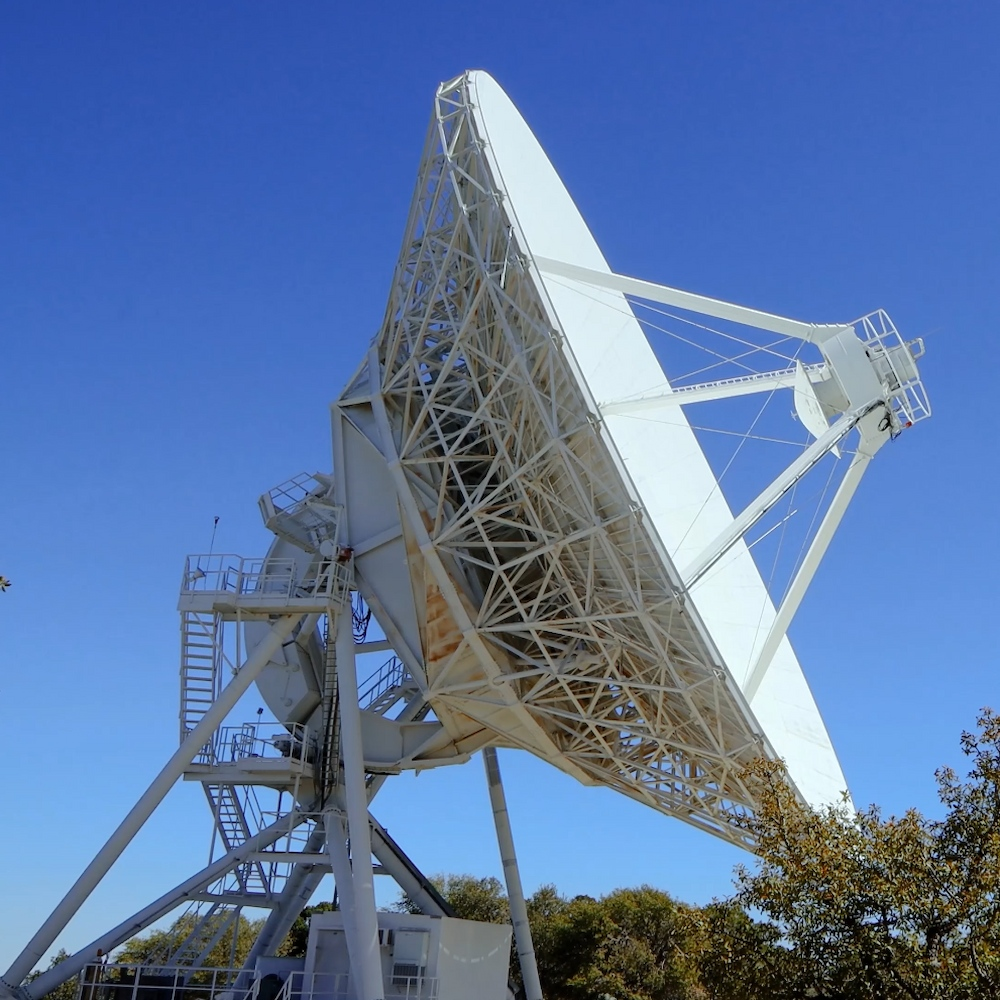
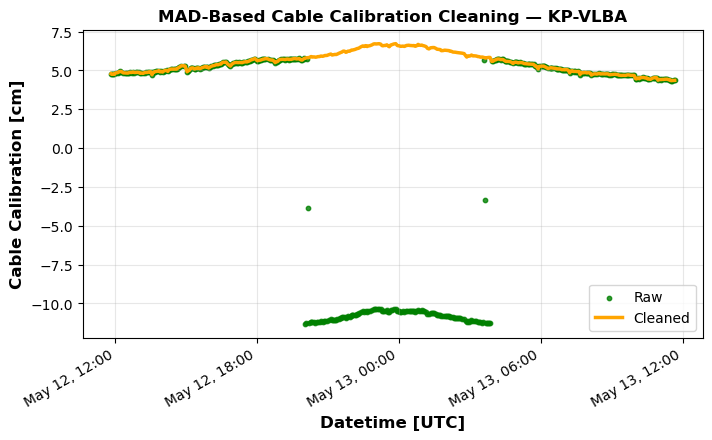
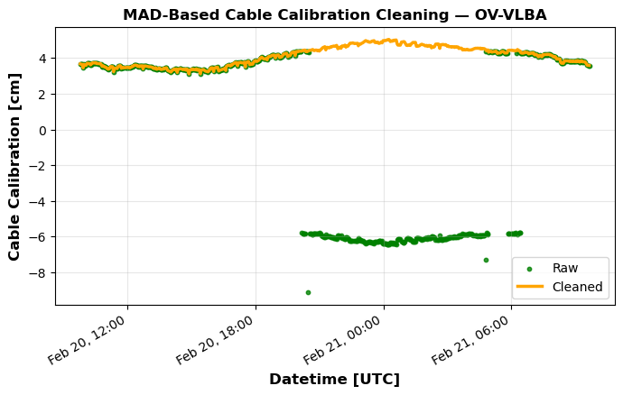
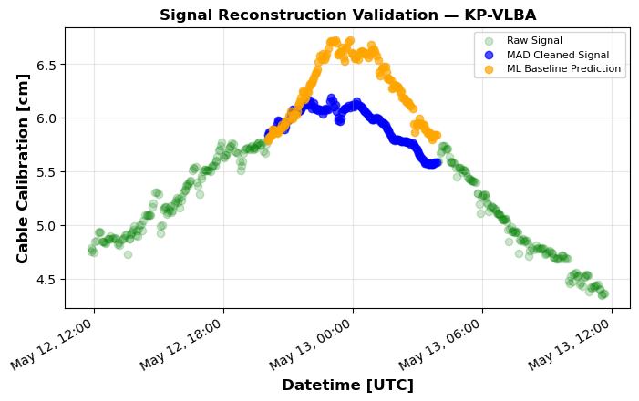
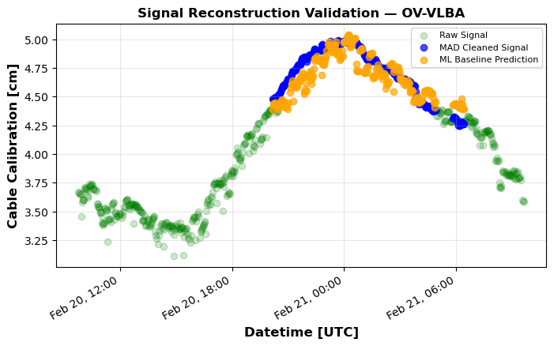
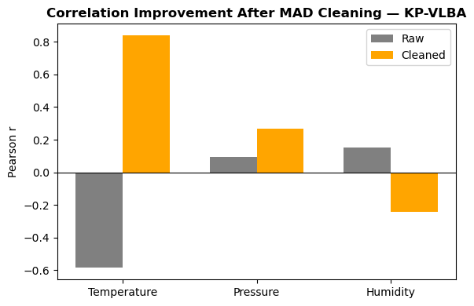
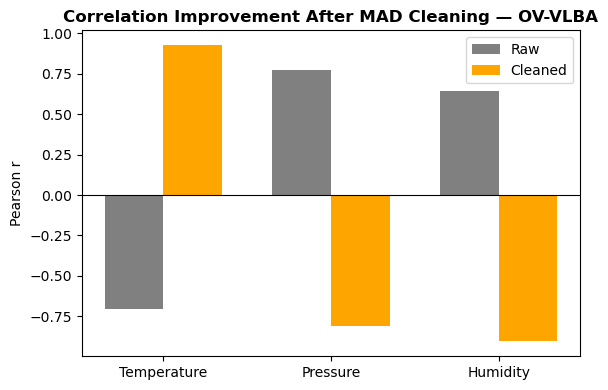

# 04. Modeling — Calibration Signal Reconstruction

<p align="center">

</p>

<p align="center"><sub><em>
VLBA antenna at Kitt Peak (KP-VLBA). Credit: KPNO/NOIRLab/NSF/AURA/T. Matsopoulos
</em></sub></p>

## Overview

This section demonstrates a **calibration signal reconstruction workflow** inspired by geodetic **Very Long Baseline Interferometry (VLBI)**.

VLBI determines Earth orientation and station positions by measuring time delays of radio signals from distant quasars. Achieving millimeter-level precision requires correcting instrumental delays in the receiving system, including **cable calibration signals** that monitor variations in signal propagation delay caused by changes in cable path length.

The objective of this workflow is to **detect discontinuities in cable calibration measurements, reconstruct a stable signal, and validate the correction using meteorological observations**.
The workflow integrates **signal cleaning, statistical modeling, and machine learning validation** in a reproducible processing pipeline.

---

## Workflow

The processing pipeline consists of three stages:

1. **Signal cleaning** — detect and remove discontinuities using Median Absolute Deviation (MAD)  
2. **Baseline modeling** — predict calibration behavior from environmental variables  
3. **Reconstruction validation** — compare reconstructed signals with model predictions  

The entire workflow can be executed automatically:

```bash
python run_pipeline.py
````

Core modules:

```bash
src/mad_detection.py
src/pca_regression.py
run_pipeline.py
```
Environmental variables (**temperature, pressure, humidity**) are used to model the baseline calibration signal.
Principal Component Analysis (PCA) is applied before regression to reduce multicollinearity among predictors.

Linear regression is sufficient because cable calibration measurements are recorded at relatively low temporal resolution (≈2 minutes), resulting in fewer than ~1000 samples per daily session. Over these short intervals, calibration variations typically exhibit approximately linear behavior.

---

## Reproducibility

Install dependencies:

```bash
pip install -r requirements.txt
```

Run the pipeline:

```bash
python run_pipeline.py
```
Raw datasets are read from:

```bash
data/raw/
```

Processed outputs are written to:
```bash
data/processed/
```
Example pipeline output:

```bash
Calibration signal cleaning success.

Baseline regression validation
------------------------------
Train RMSE: 0.10 cm | Test RMSE: 0.12 cm

Reconstruction consistency check
--------------------------------
RMSE: 0.40 cm | r: 0.68
```
---

## Cable Calibration Signal Cleaning

Cable calibration measurements may contain **step discontinuities** that interrupt the temporal consistency of the signal.
Because the true calibration delay is unknown, discontinuities must be detected from **statistical inconsistencies within the observed time series**.  

Median Absolute Deviation (**MAD**) is used to identify outliers and reconstruct a continuous calibration signal.

<p align="center">


</p>

The reconstructed signal removes discontinuous steps while preserving the underlying temporal variation of the calibration measurements.

## Signal Reconstruction Validation

To verify that the reconstructed signal remains physically consistent, the cleaned calibration series is compared with a regression model trained on **meteorological variables** (temperature, pressure, humidity).

<p align="center">


</p>

The cleaned calibration signal closely follows the **ML-predicted environmental baseline**, indicating that the reconstruction preserves the environmental response of the system.

| Station | ML RMSE | Correlation |
|---------|---------|-------------|
| KP-VLBA | 0.40 cm | 0.68 |
| OV-VLBA | 0.12 cm | 0.86 |

Millimeter-level RMSE confirms that baseline cable calibration variations are largely predictable from environmental conditions.

---

## Correlation Improvement After Signal Cleaning

Removing discontinuities reveals clearer relationships between calibration measurements and environmental drivers.

<p align="center">


</p>

After signal cleaning, correlations with **temperature, pressure, and humidity** increase, indicating that discontinuities previously obscured the environmental structure of the calibration signal.

---

## Impact on VLBI Solution Stability

Improved calibration consistency propagates directly into the **clock parameter and geodetic solution**.

| Station | Cable-Cal Std  | Clock Std      | Coordinate Effect (Dominant) |
| ------- | -------------- | -------------- | ---------------------------- |
| KP-VLBA | 7.39 → 0.65 cm | 5.79 → 1.41 cm | Y −3.14 cm                   |
| OV-VLBA | 4.76 → 0.53 cm | 4.17 → 1.74 cm | E +1.19 cm                   |

Reducing calibration discontinuities decreases delay variance, improving **clock stability and station coordinate estimates**.

In VLBI group-delay measurements, **1 cm ≈ 33 picoseconds (ps)**.
Millimeter-level improvements in cable calibration therefore correspond to **picosecond-scale timing stability**, which propagates into **centimeter-level station coordinate changes**.

---

## Notebooks

Example notebooks illustrating the workflow:

```
notebooks/01_signal_cleaning.{ipynb, html}
notebooks/02_ml_validation.{ipynb, html}
```

The notebooks provide interactive exploration of signal reconstruction and environmental modeling, while the pipeline implements the reproducible processing workflow.
