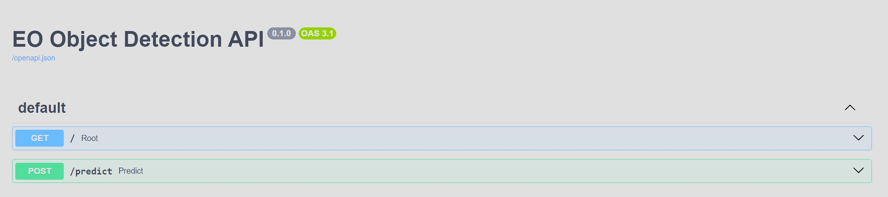
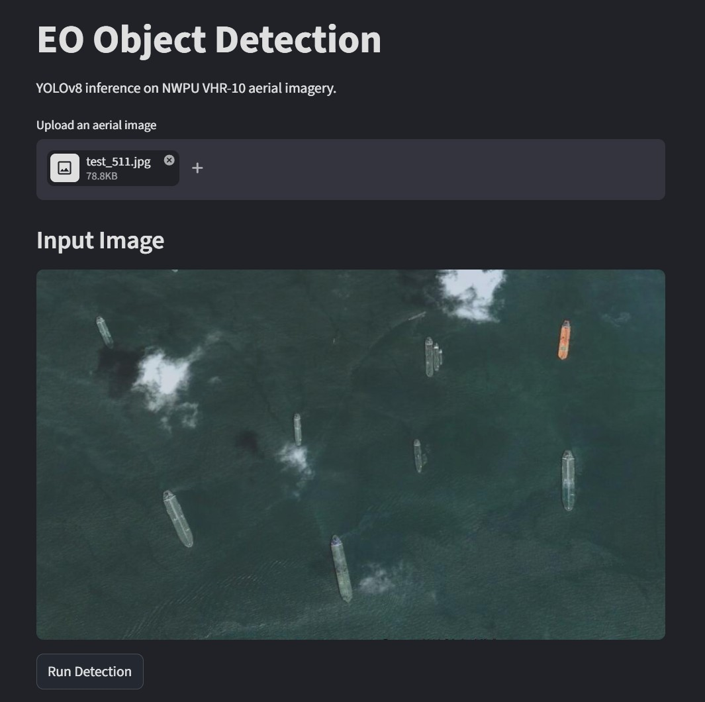
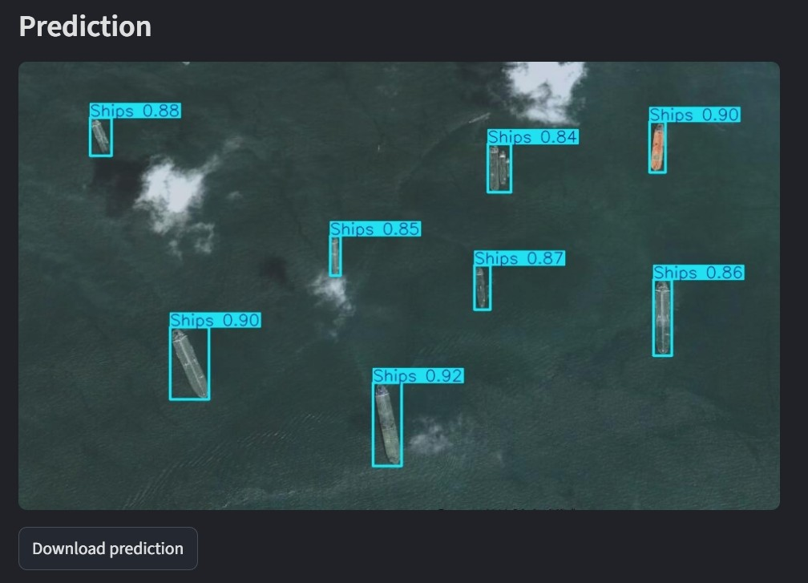

# Applied Machine Learning Portfolio

**Partist Poopat**  
M.Sc. Geodesy and Geoinformation Science – TU Berlin  

---

## Overview

This repository presents structured machine learning workflows for Earth Observation (EO), covering classification, segmentation, detection, and physically informed modeling.

Rather than focusing solely on model complexity, the emphasis is on:
- reproducible workflows
- rigorous evaluation
- small-data robustness
- physically grounded reasoning

My background in space geodesy and sensor calibration informs a signal-aware approach to machine learning for Earth system science and Earth observation data.

---

## Repository Structure

### 01. Classification (Earth Observation)

Scene-level land-use classification on EO imagery, comparing **feature-based machine learning** and **deep learning under small-data conditions**.

**What is demonstrated:**
- SVM on fixed ResNet embeddings vs CNN transfer learning  
- Controlled comparison across AlexNet, VGG, and ResNet architectures  
- Impact of model capacity on generalization  

**Dataset:**
- UC Merced Land Use Dataset (21 classes, 2,100 images)

**Key results:**
- ResNet50 achieves **98.6% accuracy**
- Deeper models show **diminishing returns**
- Feature-based SVM remains a strong baseline (~91.9%)

**Focus:**
- small-data behavior  
- representation learning vs fixed features  
- confusion matrix & error analysis  

**Visual summary:**

<p align="center">
  
  
</p>
<p align="center"><sub><em>
ResNet50 performance: normalized confusion matrix (left) and representative predictions (right).
</em></sub></p>

---

### 02. Segmentation (Earth Observation)

Pixel-wise semantic segmentation on EO imagery, evaluating **CNN and transformer models** under **small-data and class-imbalanced conditions**.

**What is demonstrated:**
- Controlled comparison of FCN, U-Net, DeepLabV3, and Transformers (SegFormer, Swin) 
- Impact of input strategy (RGB vs multispectral vs projection) 
- Effect of model complexity under limited data
- Importance of metric choice (IoU / F1 vs OA)

**Datasets:**
- LandCoverAI subset (5 classes, RGB, 100 samples)
- Landslide4Sense subset (14-channel multispectral: Sentinel-2 + ALOS PALSAR, 3,799 samples)

**Key results:**
- FCN (ResNet50) achieves strongest general segmentation baseline (**mIoU ~0.70**)
- U-Net (14-band input) performs best for landslide detection (**F1 ~63.0**)
- Transformers do not outperform CNNs under small-data constraints
- Multispectral input improves minority-class detection over RGB
- OA remains high (**>97%**) but fails to reflect minority-class performance

**Focus:**
- pixel-level evaluation (IoU / mIoU / F1)
- small-data and spatial generalization
- class imbalance effects (landslide detection)
- reproducible preprocessing pipelines

**Visual summary:**

<p align="center">
  
  
</p>
<p align="center"><sub><em>
Landcover predictions (left) and landslide predictions (right).
</em></sub></p>

---

### 03. Detection (Earth Observation)

Region-of-interest detection across three complementary EO tasks:
- **Object detection** (spatial instances) — YOLOv8  
- **Change detection** (bi-temporal differences) — DeepLabV3, U-Net, Siamese U-Net, ChangeFormer-B0  
- **Anomaly detection** (distributional deviation) — MLP Autoencoder, 1D CNN Autoencoder  

**What is demonstrated:**
- Unified comparison of detection paradigms: bounding boxes, pixel-wise change, and reconstruction-based anomaly detection  
- Controlled experiments on **model size, input resolution, and architecture**  
- Global vs local spectral modeling for hyperspectral anomaly detection  
- Task-specific evaluation under class imbalance (**mAP, mIoU, F1, PR AUC, ROC AUC**)  

**Datasets:**
- NWPU VHR-10 — RGB aerial imagery (10 classes, 650 images)  
- LEVIR-CD subset — bi-temporal RGB pairs (445 samples)  
- Pavia University subset — hyperspectral (103 bands, spatially defined anomaly regions)  

**Key results:**
- YOLOv8s (640×640) achieves best object detection performance (**mAP50–95 ~0.75, mAP50 ~0.95**)  
- DeepLabV3 / ChangeFormer-B0 perform best for change detection at higher resolution (**mIoU ~0.78, F1 ~0.86**)  
- U-Net remains competitive under limited data due to strong spatial detail preservation  
- MLP autoencoder outperforms 1D CNN for anomaly detection (**F1 ~0.78 vs 0.49**)  
- Anomaly separability is driven by **global spectral signature**, not local band-wise patterns  

**Focus:**
- detection under limited-data conditions  
- architecture–resolution trade-offs  
- metric selection under class imbalance  
- spatial vs spectral modeling assumptions  
- reproducible experimental control  

**Visual summary:**

<p align="center">
  
  
</p>
<p align="center"><sub><em>
Object detection (left) and change detection (right).
</em></sub></p>

<p align="center">
  
</p>
<p align="center"><sub><em>
Hyperspectral anomaly detection (reconstruction-based anomaly score).
</em></sub></p>

---


### 04. Modeling (Space Geodesy – VLBI)

<p align="center">


</p>

<p align="center"><sub><em>
VLBA antenna at Owens Valley (OV-VLBA). Credit: NSF/AUI/NSF NRAO/J. Hellerman (left). <br>
Analysis: calibration signal cleaning and regression-based validation (OV-VLBA, right).
</em></sub></p>


Statistical and regression-based modeling derived from calibration analysis developed during my VLBI master’s thesis.


**Includes:**
- residual analysis
- multicollinearity mitigation (PCA)
- anomaly detection (MAD)
- uncertainty discussion
- RMSE and correlation validation

This section reflects the transfer of calibration modeling concepts from space geodesy (Very Long Baseline Interferometry, VLBI) to applied machine learning for high-precision Earth system measurements.

A reproducible processing **pipeline** (`run_pipeline.py`) implements the
complete modeling workflow, demonstrating automated and repeatable
analysis of calibration signals.

**Key results:**  
(two examples from VLBI 24-hour sessions)
- Cable calibration signal variance reduced by **~90%** in representative cases, from **7.40 → 0.65 cm (KP-VLBA, −91%)** and **4.76 → 0.53 cm (OV-VLBA, −89%)**
- Clock stability improved from **5.79 → 1.41 cm (KP-VLBA, −76%)** and **4.17 → 1.74 cm (OV-VLBA, −58%)**  
  *(In VLBI group-delay units **1 cm ≈ 33 ps**, indicating picosecond-level timing stability)*
- Environmental regression validation achieved **RMSE 0.12–0.40 cm (millimeter-level precision)**
- Millimeter-level calibration improvements propagate into **centimeter-level station coordinate changes** (e.g., **Y −3.14 cm**, **E +1.19 cm**), which are critical for **precise satellite positioning and global Earth monitoring**

---

### Deployment Demo

Inference-only deployment of a trained EO object detection model (YOLOv8, NWPU VHR-10) as a reproducible API service. 

This extends the object detection pipeline from Section 03 – Detection,  demonstrating end-to-end inference, API serving, and deployment.

```text
Upload image → FastAPI → YOLOv8 inference → Streamlit UI → Docker → CI (GitHub Actions) → CD (Render, live API)
````

<p align="center">
  
</p>

**Live API:** https://eo-deployment-demo.onrender.com/docs

<p align="center">
  
  
</p>

<p align="center"><sub><em>
UI input (left), and prediction output (right).
</em></sub></p>


## Technical Stack

- Python
- PyTorch
- Scikit-learn
- NumPy / Pandas
- Matplotlib

## Philosophy

The objective is not state-of-the-art performance alone, but clarity, interpretability, and reproducible engineering practice for machine learning in Earth Observation and Earth system science.

## Acknowledgment

Sections 01–03 (Classification, Segmentation, Detection) build on concepts and baseline implementations from the AI4RS (Artificial Intelligence for Remote Sensing) course. These have been significantly extended with additional experiments, evaluation, and analysis.

## Data Sources

Section 04 (Modeling – VLBI) utilizes data derived from International VLBI Service (IVS) observations. Auxiliary data (e.g., cable calibration and meteorological parameters) were reformatted into CSV for reproducible machine learning experiments. Parameters such as clock offset, rate, and quadratic terms, along with station coordinates, were obtained through standard VLBI analysis workflows (e.g., PORT).
