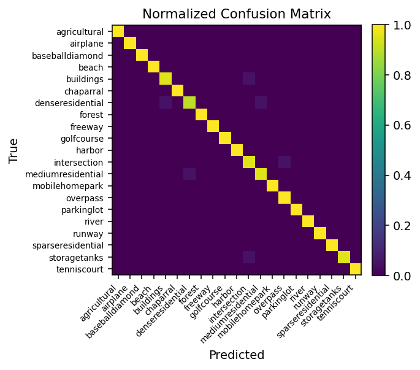
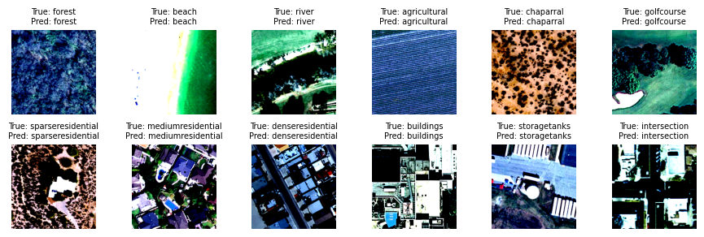
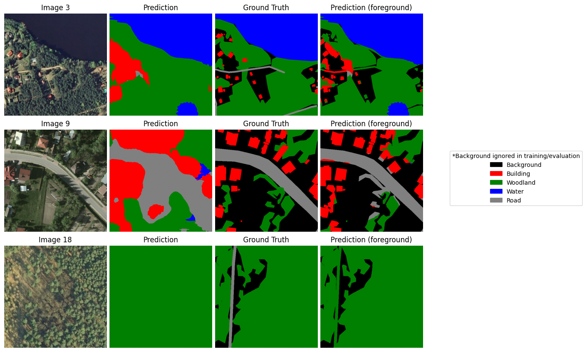
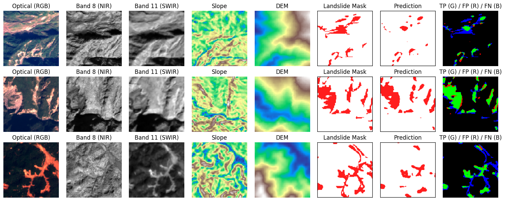
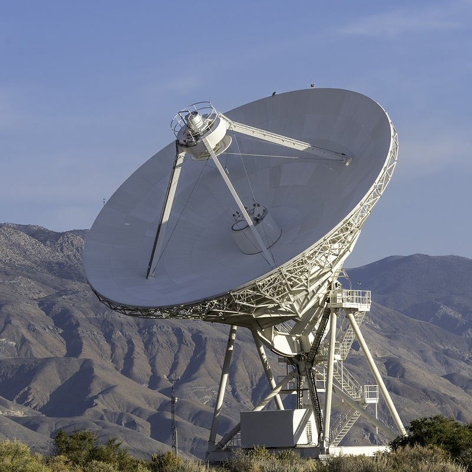
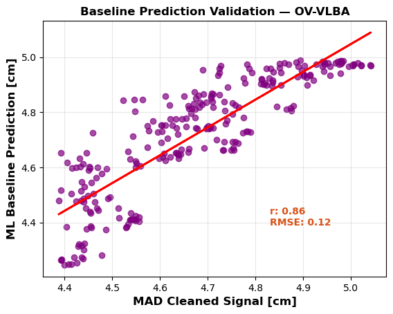

# Applied Machine Learning Portfolio

**Partist Poopat**  
M.Sc. Geodesy and Geoinformation Science – TU Berlin  

---

## Overview

This repository presents structured machine learning workflows for Earth Observation (EO), covering classification, segmentation, detection, and physically informed modeling.

Rather than focusing solely on model complexity, the emphasis is on:
- reproducible workflows
- rigorous evaluation
- small-data robustness
- physically grounded reasoning

My background in space geodesy and sensor calibration informs a signal-aware approach to machine learning for Earth system science and Earth observation data.

---

## Repository Structure

### 01. Classification (Earth Observation)

Scene-level land-use classification on EO imagery, comparing **feature-based machine learning** and **deep learning under small-data conditions**.

**What is demonstrated:**
- SVM on fixed ResNet embeddings vs CNN transfer learning  
- Controlled comparison across AlexNet, VGG, and ResNet architectures  
- Impact of model capacity on generalization  

**Dataset:**
- UC Merced Land Use Dataset (21 classes, 2,100 images)

**Key results:**
- ResNet50 achieves **98.6% accuracy**
- Deeper models show **diminishing returns**
- Feature-based SVM remains a strong baseline (~91.9%)

**Focus:**
- small-data behavior  
- representation learning vs fixed features  
- confusion matrix & error analysis  

**Visual summary:**

  
  

<em>
ResNet50 performance: normalized confusion matrix (left) and representative predictions (right).
</em>

---

### 02. Segmentation (Earth Observation)

Pixel-wise semantic segmentation on EO imagery, evaluating **CNN and transformer models** under **small-data and class-imbalanced conditions**.

**What is demonstrated:**
- Controlled comparison of FCN, U-Net, DeepLabV3, and Transformers (SegFormer, Swin) 
- Impact of input strategy (RGB vs multispectral vs projection) 
- Effect of model complexity under limited data
- Importance of metric choice (IoU / F1 vs OA)

**Datasets:**
- LandCoverAI subset (5 classes, RGB, 100 samples)
- Landslide4Sense subset (14-channel multispectral: Sentinel-2 + ALOS PALSAR, 3,799 samples)

**Key results:**
- FCN (ResNet50) achieves strongest general segmentation baseline (**mIoU ~0.70**)
- U-Net (14-band input) performs best for landslide detection (**F1 ~63.0**)
- Transformers do not outperform CNNs under small-data constraints
- Multispectral input improves minority-class detection over RGB
- OA remains high (**>97%**) but fails to reflect minority-class performance

**Focus:**
- pixel-level evaluation (IoU / mIoU / F1)
- small-data and spatial generalization
- class imbalance effects (landslide detection)
- reproducible preprocessing pipelines

**Visual summary:**

  
  

<em>
Landcover predictions (left) and landslide predictions (right).
</em>

---

### 03. Detection (Earth Observation)
Spatial and temporal detection tasks including:
- object detection
- change detection (multi-temporal Sentinel-2)
- anomaly detection

**Datasets:**
- (to be added)

**Key results:**
- (evaluation metrics to be added)

**Focus:**
- region-of-interest identification
- seasonal noise discussion
- baseline vs DL comparison

---

### 04. Modeling (Space Geodesy – VLBI)

<em>
VLBA antenna at Owens Valley (OV-VLBA). Credit: NSF/AUI/NSF NRAO/J. Hellerman (left).  
Analysis: calibration signal cleaning and regression-based validation (OV-VLBA, right).
</em>

Statistical and regression-based modeling derived from calibration analysis developed during my VLBI master’s thesis.

**Includes:**
- residual analysis
- multicollinearity mitigation (PCA)
- anomaly detection (MAD)
- uncertainty discussion
- RMSE and correlation validation

This section reflects the transfer of calibration modeling concepts from space geodesy (Very Long Baseline Interferometry, VLBI) to applied machine learning for high-precision Earth system measurements.

A reproducible processing **pipeline** (`run_pipeline.py`) implements the
complete modeling workflow, demonstrating automated and repeatable
analysis of calibration signals.

**Key results:**  
(two examples from VLBI 24-hour sessions)
- Cable calibration signal variance reduced by **~90%** in representative cases, from **7.40 → 0.65 cm (KP-VLBA, −91%)** and **4.76 → 0.53 cm (OV-VLBA, −89%)**
- Clock stability improved from **5.79 → 1.41 cm (KP-VLBA, −76%)** and **4.17 → 1.74 cm (OV-VLBA, −58%)**  
  *(In VLBI group-delay units **1 cm ≈ 33 ps**, indicating picosecond-level timing stability)*
- Environmental regression validation achieved **RMSE 0.12–0.40 cm (millimeter-level precision)**
- Millimeter-level calibration improvements propagate into **centimeter-level station coordinate changes** (e.g., **Y −3.14 cm**, **E +1.19 cm**), which are critical for **precise satellite positioning and global Earth monitoring**

---

### 05. Fusion Pipeline (Remote Sensing – SAR + Optical)
End-to-end ML pipeline integrating Sentinel-1 SAR (VV, VH) and Sentinel-2 optical data for flood segmentation under real-world observation constraints.

**Datasets:**
- (to be added)

**Key results:**
- (IoU / F1-score / qualitative flood maps to be added)

**Includes:**
- GeoTIFF ingestion with Rasterio (GDAL)
- SAR (VV/VH) and multispectral stacking (RGB + NIR)
- resolution alignment and normalization
- multimodal feature fusion with U-Net
- pixel-wise flood probability and thresholding

A reproducible pipeline (`run_pipeline.py`) implements the workflow from data ingestion to inference.

Representative outputs show consistent flood detection, with SAR enabling reliable mapping under cloud-covered conditions where optical imagery alone degrades.

---

### 06. Time-Series (Remote Sensing - InSAR)

Temporal modeling of ground deformation signals derived from InSAR observations using sequence models (LSTM / Transformer).

**Datasets:**
- (to be added)

**Key results:**
- (MAE / RMSE / prediction plots to be added)

**Focus:**
- time-series representation of EO-derived geodetic signals  
- persistence baseline (`yₜ₊₁ = yₜ`) vs learned sequence models
- comparison of LSTM and Transformer for short-term deformation forecasting
- interpretation under noise and measurement uncertainty  

This section demonstrates how InSAR displacement time series can be formulated as supervised learning problems, highlighting the role of temporal modeling in deformation monitoring and Earth system analysis.

---

## Technical Stack

- Python
- PyTorch
- Scikit-learn
- NumPy / Pandas
- Matplotlib
- Rasterio / GDAL

## Philosophy

The objective is not state-of-the-art performance alone, but clarity, interpretability, and reproducible engineering practice for machine learning in Earth Observation and Earth system science.

## Acknowledgment

Sections 01–03 (Classification, Segmentation, Detection) build on concepts and baseline implementations from the AI4RS (Artificial Intelligence for Remote Sensing) course. These have been significantly extended with additional experiments, evaluation, and analysis.

## Data Sources

Section 04 (Modeling – VLBI) utilizes data derived from International VLBI Service (IVS) observations. Auxiliary data (e.g., cable calibration and meteorological parameters) were reformatted into CSV for reproducible machine learning experiments. Parameters such as clock offset, rate, and quadratic terms, along with station coordinates, were obtained through standard VLBI analysis workflows (e.g., PORT).
