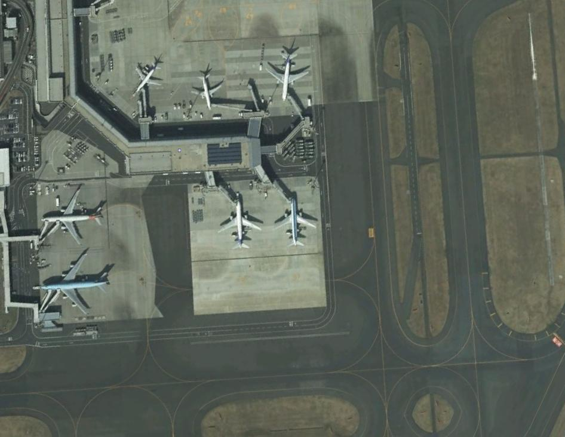
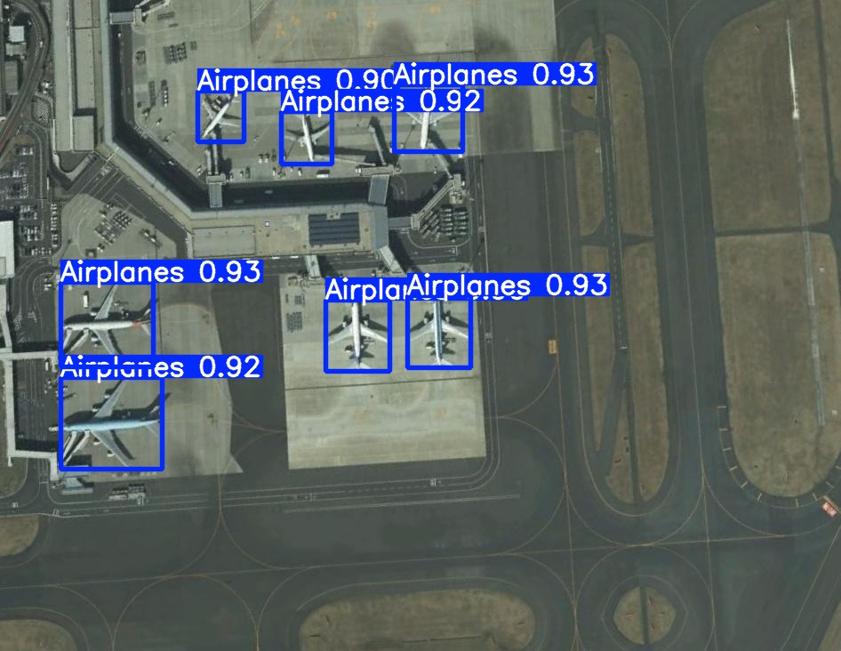
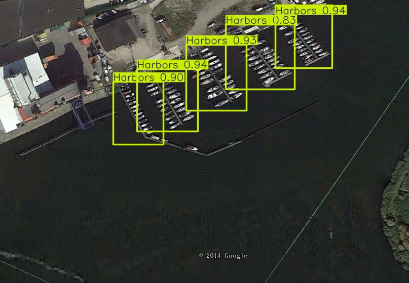
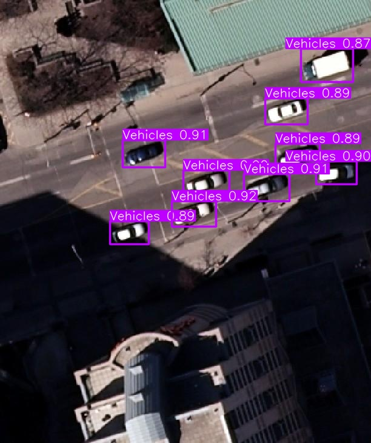
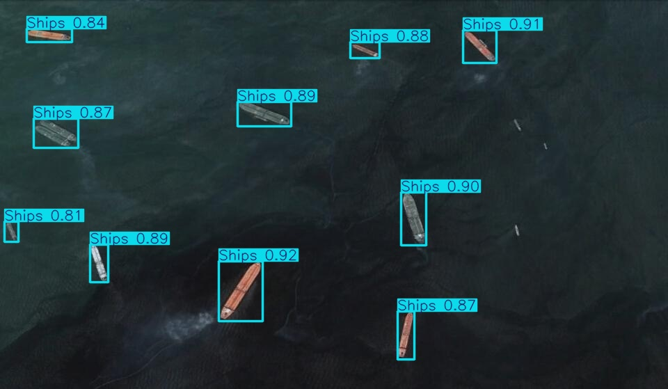
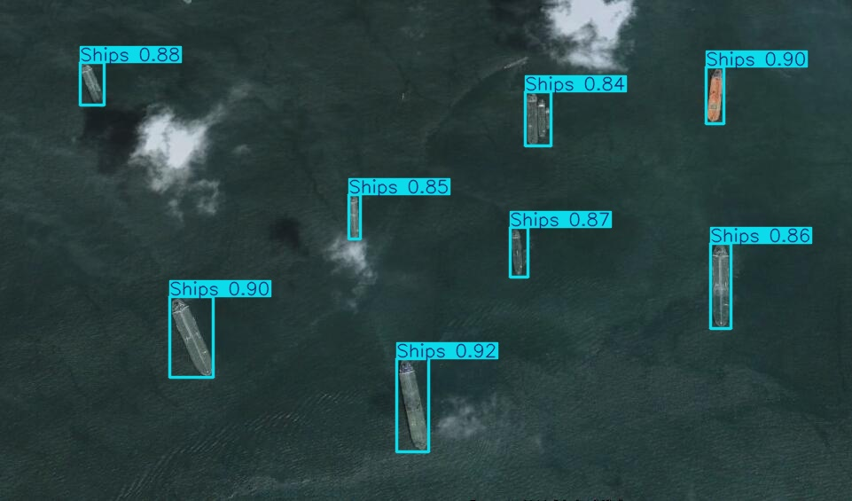

# Deployment Demo

Inference-only deployment of a trained EO object detection model as an API.

This demo extends the object detection pipeline from **Section 03 – Detection**, where a YOLOv8 model trained on NWPU VHR-10 is deployed as an inference API using the held-out test split.

## Purpose

VHR aerial image → YOLOv8 → object detection API  
Focus: **EO object detection + ML inference + deployment (CI/CD)**

## Flow

```text
Upload image → FastAPI → YOLOv8 → annotated image → Streamlit UI → Docker → CI → CD (Render, live API)
````

---

## I/O

Input: 
```text
sample_data/ 
test_3.jpg ... test_649.jpg (130 test images, 5 used for this demo)
```
* upload an aerial image
* run YOLO inference
* visualize detected objects

Output:
- annotated image with bounding boxes and class labels
- detection summary printed to console

<p align="center">
 
 
</p>

```bash
========== Detection Summary ==========
{'num_detections': 7, 'summary': {'Airplanes': {'count': 7, 'average_confidence': 0.918}}}
```

Sample Predictions:
<p align="center">
  
  
  
  
</p>


## Run

API (FastAPI): http://127.0.0.1:8000/docs

```bash
pip install -r requirements.txt
python -m uvicorn app:app --reload
```

UI (Streamlit):  http://localhost:8501

```bash
python -m streamlit run streamlit_app/app.py
```

Docker (API):  http://127.0.0.1:8000/docs

```bash
docker build -t eo-deployment-demo .
docker run -p 8000:8000 eo-deployment-demo
```

## CI/CD

```text
git push → CI (GitHub Actions) → CD (Render) → live API
```
Live API: https://eo-deployment-demo.onrender.com/docs  
*(Docker-based deployment)*


---

## Stack

YOLOv8 · Ultralytics · PyTorch · FastAPI · Streamlit  
Docker · GitHub Actions · Render 
